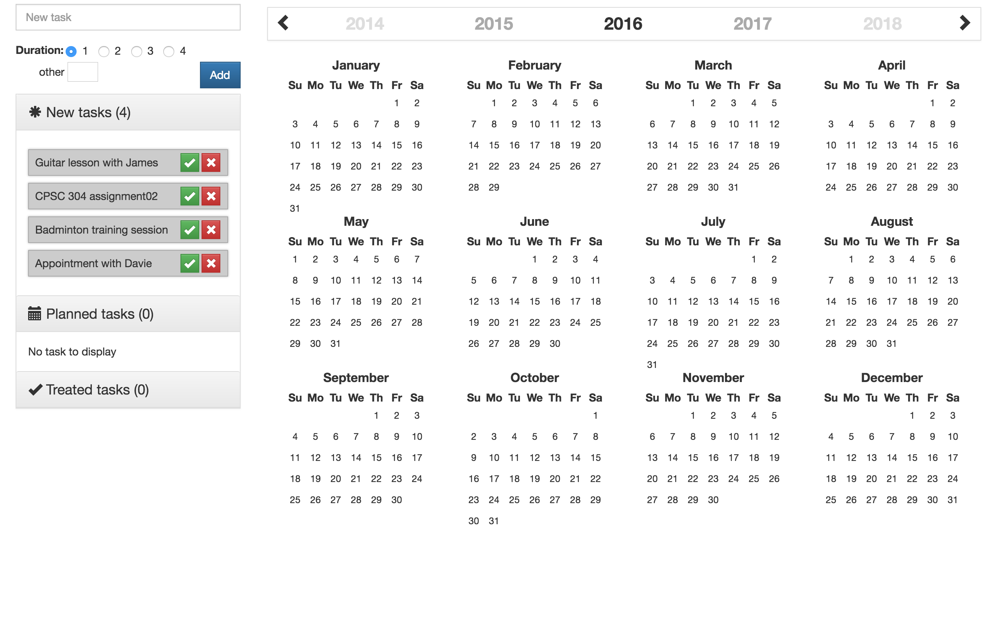
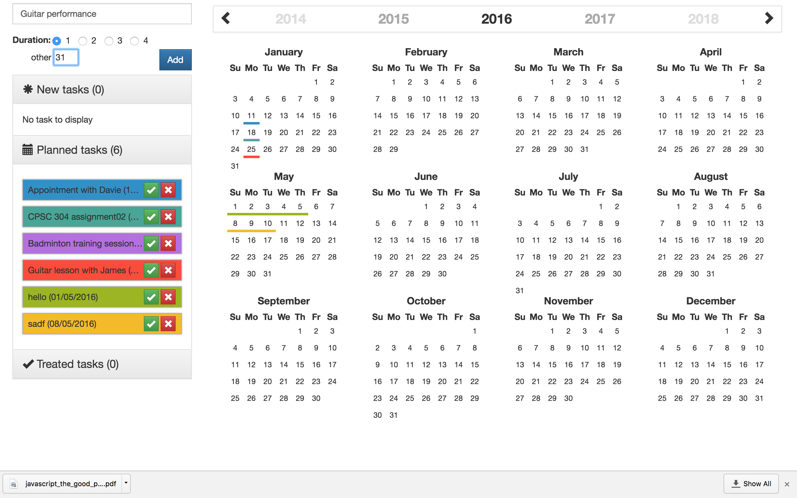
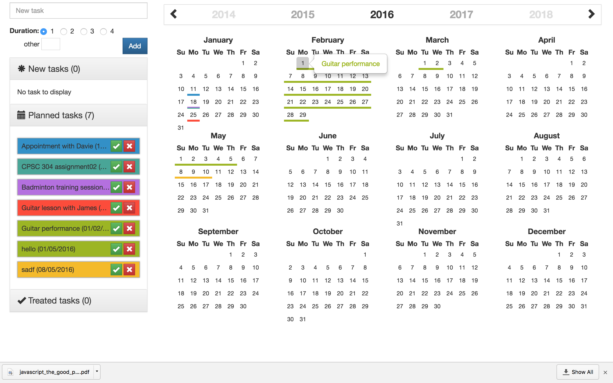
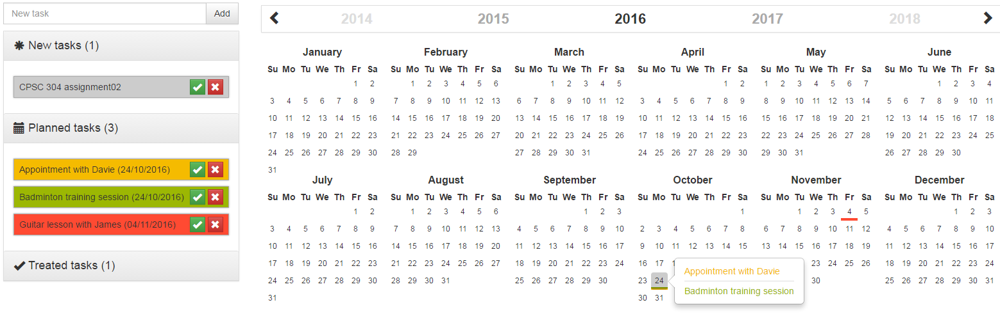

# To-Do-List
This project has improved the use of a normal to-do-list by using the dragable functionality from jquery, so that user can have a better interaction between the tasks-list and the Calender. That brings up the goal of this project which enables users to drag the list-items directly into the Calender.

This application use the following librarires:
- [jQuery](https://jquery.com/)
- [Bootstrap](http://getbootstrap.com/)
- [JsRender](https://www.jsviews.com/)
- [Moment.js](http://momentjs.com/)
- [bootstrap-year-calendar](http://www.bootstrap-year-calendar.com/)

